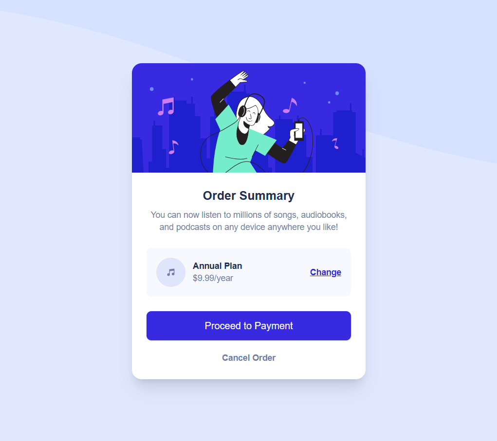

# 💳 Order Summary Card

  A clean and elegant order summary card built with **React + TypeScript** and **Tailwind CSS**. This component is fully responsive and uses modern styling practices to deliver a smooth UI experience.

  ## 🚀 Live Demo

  - 🌐 **Live Site URL**: [View it in action](https://your-live-site-url.com)
  - 💻 **Solution URL**: [See the code](https://github.com/SanyaShresta25/Order-Summary)

  ## 📸 Screenshot

  

  ## 🧱 Built With

  - ⚛️ **React** (with TypeScript) – Functional components and prop-driven design
  - 🎨 **Tailwind CSS** – Utility-first styling with responsive design baked in
  - 📱 Mobile-first responsive design approach

  ## ✨ Features

  - 🖼️ Hero image at the top
  - 📋 Order summary with plan details
  - 🔄 “Change Plan” functionality placeholder
  - ✅ Responsive layout for mobile & desktop
  - 🎵 Music icon and custom background wave pattern

  ## 🧠 What I Learned

  - How to create **reusable functional components** in React using props
  - Using **inline SVGs as background images** with Tailwind styling
  - Implementing **mobile-first responsive UI** with Tailwind's utility classes
  - Structuring code in a clean, maintainable format with clear comments

  ## 🔧 How to Use

  ```bash
  # Clone the repo
  git clone https://github.com/SanyaShresta25/my-app.git
  cd my-app

  # Install dependencies
  npm install

  # Run the app
  npm run dev
  ```

  ## 🔄 Future Enhancements

  - Add support for multiple pricing plans
  - Animate card transitions (e.g., when selecting a plan)
  - Improve accessibility (ARIA roles, keyboard navigation)

  ## 📚 Useful Resources

  - [Tailwind CSS Docs](https://tailwindcss.com/docs)
  - [React TypeScript Cheatsheet](https://react-typescript-cheatsheet.netlify.app/)
  - [MDN Web Docs: Using data URIs](https://developer.mozilla.org/en-US/docs/Web/HTTP/Basics_of_HTTP/Data_URIs)

  ## 👩‍💻 Author

  - **Portfolio** – [Sanya Shresta Jathanna](https://sanyashresta.netlify.app/)
  - **GitHub** – [@SanyaShresta25](https://github.com/SanyaShresta25)
  - **Frontend Mentor** – [@SanyaShresta25](https://www.frontendmentor.io/profile/SanyaShresta25)

  ## 🙏 Acknowledgments

  - Inspired by [Frontend Mentor – Order Summary Card Challenge](https://www.frontendmentor.io/challenges/order-summary-component-QlPmajDUj)
  - Shoutout to the dev community for Tailwind tips and best practices!
